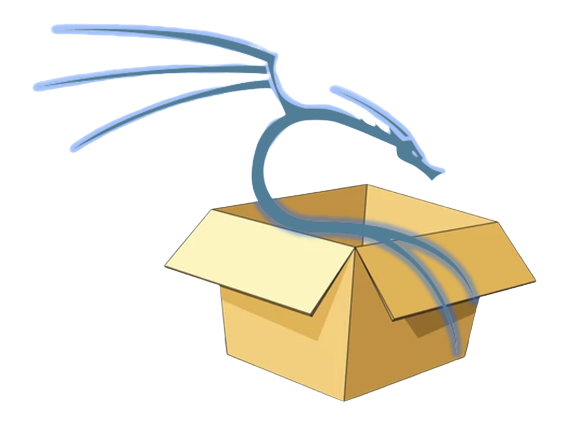
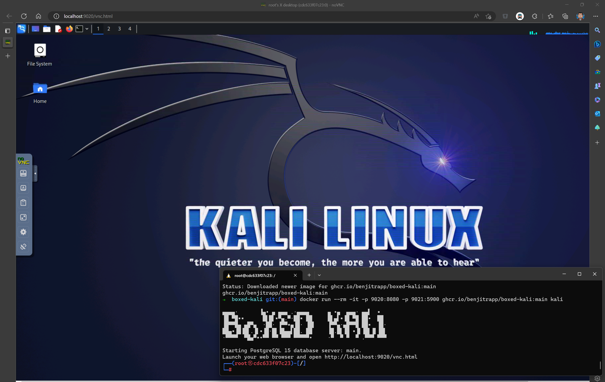

[](https://github.com/BenjiTrapp/boxed-kali/actions/workflows/docker-publish.yml)

<p align="center">

<br>Boxed Kali in your Browser
</p>

This repository focusses on a dockerized version of Kali that can be accessed over noVnc in your Browser. The main usage for this way is an additional isolation by the containerization approach. Personally I use this container to perform analysis of potential malicious files and penetration tests within the AWS Cloud and Active Directory.

## Prerequisites

You require:

* Docker
* Browser
* ~10GB of Storage
* At least 4GB of RAM

## What do you get ?

The following packages are coming pre-installed but can be enhanced by inheriting this image and add the dependencies you need:

* kali-tools-top10
* kali-tools-forensics
* kali-tools-web
* kali-tools-windows-resources
* binutils
* burpsuite
* libproxychains4
* proxychains4
* exploitdb
* bloodhound
* kerberoast
* fail2ban
* whois
* ghidra
* sslscan
* traceroute
* whois
* powershell
* git
* jq
* gobuster
* awscli
* pacu
* endgame
* trufflehog
* Jupyter Notebook

## Usage

Directly pull from GitHub and run the container:

```bash
docker pull ghcr.io/benjitrapp/boxed-kali:nightly
docker run --rm -it -p 9020:8080 -p 9021:5900 ghcr.io/benjitrapp/boxed-kali:nightly kali
```

Alternative usage over the [Makefile](https://github.com/BenjiTrapp/boxed-kali/blob/main/Makefile). The Makefile also contains all essential steps to build, run and access the boxed Kali with your browser. You can get a glimpse how it is working here:

<p align="center">

<br>Download the GitHub Image using the Makefile
</p>

After the successful download open your Browser and navigate to `http://localhost:9020/vnc.html` to access Kali and haven't override the environment variable `VNCPWD` the default password is simply `password`. After the login you should see something similar to this (running Kali 2022.4 at the time of writing this):

<p align="center">

<br>Boxed Kali in your Browser
</p>

## How to customize the setup

If you want to use a different port, change the password or tweak the noVnc/VNC installation these variables might be valuable for you:

| Name           | Default   | Semantics                                                       |
| -------------- | --------- | --------------------------------------------------------------- |
| VNCEXPOSE      | 1         | Value `1` exposes VNC else localhost only                              |
| VNCPWD         | password  | Default password for entering noVnc                             |
| VNCDISPLAY     | 1920x1080 | Display resolution                                              |
| VNCDEPTH       | 16        | Display quality > if more resources available set to `24`       |
| VNCPORT        | 5900      | Port which exposes the vncserver                                |
| USER           | root      | Default user might break (kali) packages                        |
| NOVNCPORT      | 8080      | Port which exposes noVnc                                        |
| DNS_NAMESERVER | 8.8.8.8   | If you require a custom DNS nameserver under `/etc/resolv.conf` |

**Remark**: If you change the ports, the makefile wont work anymore

### Not the packages installed that you require?

You can simply inherit from my image and install all the stuff that you need:

```bash
FROM  ghcr.io/benjitrapp/boxed-kali:nightly

# Install a package over apt
RUN apt-get install -y --no-install-recommends --allow-unauthenticated <your kali package>

# Install a python package
RUN pip3 install --break-system-package --no-cache-dir <your python package>

# Install a go package
RUN go get github.com/usr/repo
      
```
